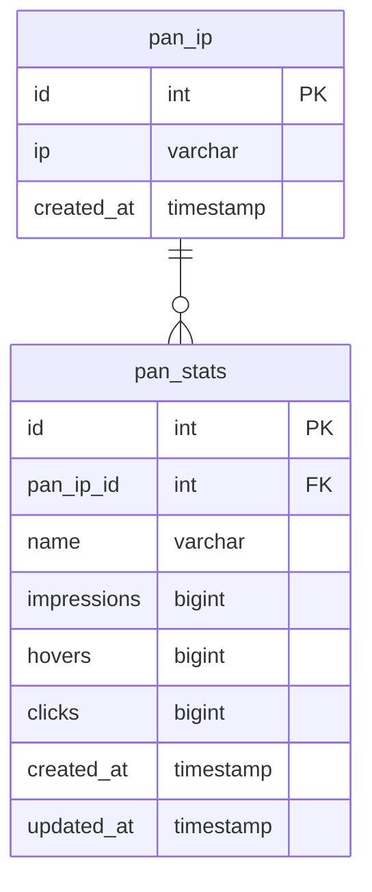

## Modifs apportées

Pour un de mes projets j'ai besoin de garder l'IP avec les stats, j'ai donc ajouté deux tables :

- pan_ip
- pan_stats



Je n'ai pratiquement pas modifié le fonctionnement de base du package. 
J'ai juste rajouté ce dont j'ai mesoin.  
Peut-être que je vais faire sauter la partie d'origine qui permet d'enregistrer
les données dans la table ***pan_analytics***. 

## Avertissement

Le code SQL est fait pour être utilisé avec PostgreSQL.

## Installation

La méthode d'installation reste inchangée.

```bash
composer require panphp/pan
php artisan install:pan
```

## Visualisation des stats

A part la commande d'origine qui permet de visualiser les stats de la table ***pan_analytics***, 
il n'est pas possible de voir les données des tables ***pan_ip*** et ***pan_stats***.
J'utilise ces données sur une page dédiée dans le projet avec lequel se trouve déployé ce package. 
